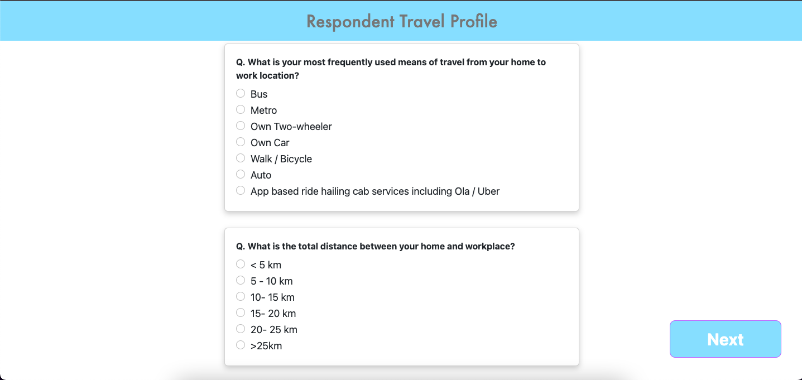
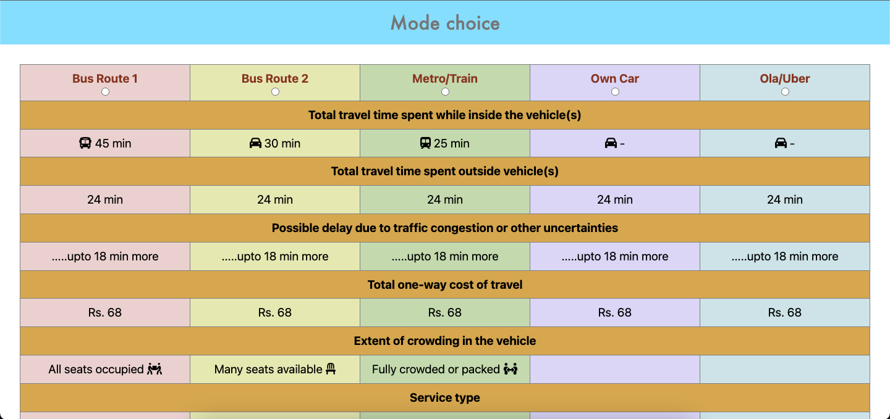

# Project Name

IISC INTERNSHIP TASK
## Screenshots

  
*Caption: This is a screenshot of my project's homepage.*

*Caption: This is a screenshot of my project's choicemode.*

## Libraries Used

- Libraries:
The project used several third-party libraries, including:
- FontAwesomeReact: A library for adding icons to the project
- React-Bootstrap: A popular CSS framework for building responsive designs
- React-toastify: A library for adding notification toasts to the project


## Getting Started

### Installation

1. Clone the repo
   ``
   git clone https://github.com/your_username_/Project-Name.git
   ``

2. Install dependencies   
 ``` npm install ```

 ## Contact

Your Name - Mukesh kumar Bagaria
Email - mkbagaria13@gmail.com

Project hosted link: https://visionary-bienenstitch-cbc582.netlify.app/